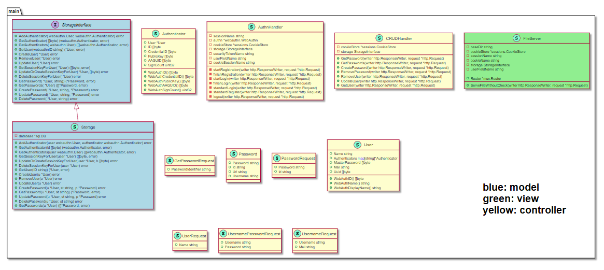
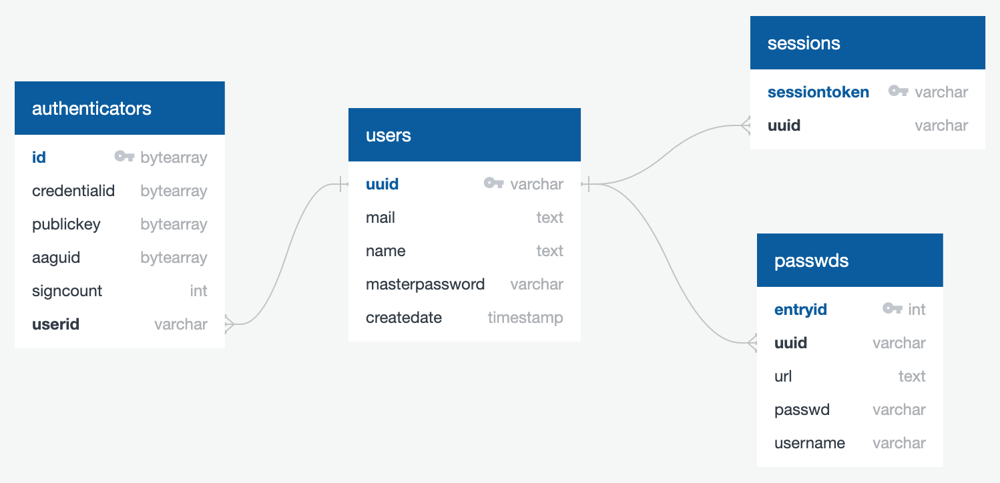

# KeyCloud  - Software Architecture Document

## Table of Contents
- [KeyCloud  - Software Architecture Document](#keycloud---software-architecture-document)
  - [Table of Contents](#table-of-contents)
  - [1. Introduction](#1-introduction)
    - [1.1 Purpose](#11-purpose)
    - [1.2 Scope](#12-scope)
    - [1.3 Definitions, Acronyms and Abbreviations](#13-definitions-acronyms-and-abbreviations)
    - [1.4 References](#14-references)
    - [1.5 Overview](#15-overview)
  - [2. Architectural Representation](#2-architectural-representation)
    - [2.1 Technologies used](#21-technologies-used)
  - [3. Architectural Goals and Constraints](#3-architectural-goals-and-constraints)
  - [4. Use-Case View](#4-use-case-view)
    - [4.1 Use-Case Realizations](#41-use-case-realizations)
  - [5. Logical View](#5-logical-view)
    - [5.1 Design Pattern](#51-design-pattern)
  - [6. Process View](#6-process-view)
  - [7. Deployment View](#7-deployment-view)
  - [8. Implementation View](#8-implementation-view)
  - [9. Data View](#9-data-view)
  - [10. Size and Performance](#10-size-and-performance)
  - [11. Quality](#11-quality)

## 1. Introduction
### 1.1 Purpose
This document provides an architectural overview of the system, using a number of different architectural views.
### 1.2 Scope
The scope of this SAD is to show the overall architecture of the KeyCloud project. Use-Cases, classes used in the backend and the database structure are depicted.
### 1.3 Definitions, Acronyms and Abbreviations
Abbreviation | |
--- | --- 
IDE | Integrated Development Environment
MVC | Model View Controller
n/a | not applicable  
SAD | Software Architecture Document
SRS | Software Requirements Specification
tbd | to be determined
UC | Use Case

Definition | |  
--- | ---  
Software Architecture Document | The Software Architecture Document provides a comprehensive architectural overview of the system, using a number of different architectural views to depict different aspects of the system.
### 1.4 References
Title | Date | Publishing organization |  
--- | :---:  | ---
[KeyCloud Blog](https://keycloud.zeekay.dev/) | 12.10.2019 | KeyCloud  
[YouTrack Instance](https://youtrack.zeekay.dev/) | 12.10.2019 | KeyCloud  
[SRS](../doc/SRS.md) | 12.10.2019 | KeyCloud  
[TeamCity](https://teamcity.zeekay.dev/) | 19.11.2019 | KeyCloud
[KeyCloud Application](https://keycloud-dev.zeekay.dev/dashboard/) | 27.06.2020 | KeyCloud
### 1.5 Overview
This document contains the architectural representation, goals and constraints.

## 2. Architectural Representation
Our application is build using Golang in the backend and Angular (cosmetics are made using material design). 
Because Golang is a multi-paradigm language which mainly works functional, we do not have relationships between our classes. 
This is also the reason why we don't have a MVC architecture. Nevertheless, we tried our best to divide our classes up in these three categories.
### 2.1 Technologies used
IDEs:
- Frontend: JetBrains WebStorm
- Backend: JetBrains GoLand

Languages:
- Frontend: 
- Backend: Golang
- Database: PostgreSQL
- Testing: Java (Cucumber), Golang, Karma test, User test

## 3. Architectural Goals and Constraints
Our architecture should be able to be used in the cloud, therefore our final version has to be somewhat containerized.

## 4. Use-Case View

### 4.1 Use-Case Realizations
Further details on each UC can be found [here](https://github.com/keycloud/docs/tree/master/doc/UC).

## 5. Logical View
The following graphic describes the overall class organization of the backend.  

### 5.1 Design Pattern
The adapter design pattern is contained with the usage of the StorageInterface (upper-left corner). It enables us to completly isolate the way we store our data, from the way we consume it, as the interface is only defined by the interface. This allowed to simplify development at the beginning by simply use a dummy in-memory way of storing the actual data. Later on within the development we were able to connect a database by writing new functions that implement the StorageInterface without changing a single line of code of our logic part. Even in the future we can just add new ways of storing the data, only by adding a new implementation of the interface.
## 6. Process View
n/a

## 7. Deployment View  

## 8. Implementation View
The complete implementation can be found in [this](https://github.com/keycloud/keycloud) repository.

## 9. Data View
The following diagram describes the relationship model of our database.  

## 10. Size and Performance
There are no specific requirements for the size or performance aside that the performance shouldn't be anoyingly slow.

## 11. Quality
The quality of our code and product should be as high as possible. To ensure this we use automated CI/CD (look at our [testplan](https://github.com/keycloud/docs/blob/master/doc/TestPlan.md) for further details).
