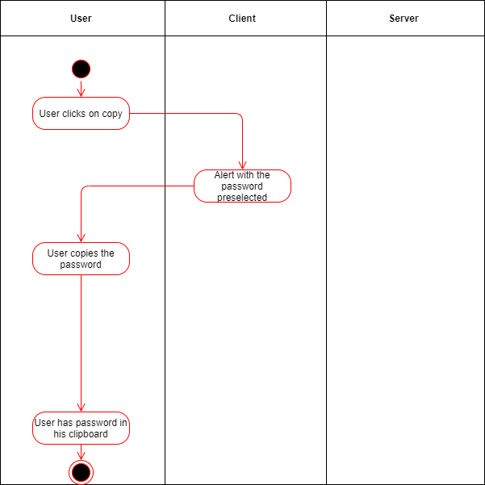
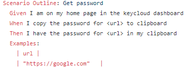
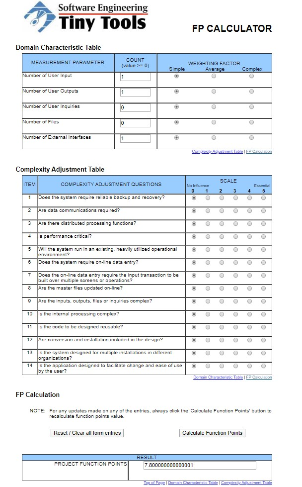

## Table of Contents
- [Table of Contents](#table-of-contents)
- [1. Use-Case Add Password](#1-use-case-add-password)
  - [1.1 Brief Description](#11-brief-description)
- [2. Flow of Events](#2-flow-of-events)
  - [2.1 Basic Flow](#21-basic-flow)
    - [2.1.1 Activity Diagram](#211-activity-diagram)
    - [2.1.2 Mock up](#212-mock-up)
  - [2.2 Alternative Flows](#22-alternative-flows)
- [3. Special Requirements](#3-special-requirements)
- [4. Preconditions](#4-preconditions)
- [5. Postconditions](#5-postconditions)
- [6. Extension Points](#6-extension-points)
- [7. Function Points](#7-function-points)

## 1. Use-Case Add Password
### 1.1 Brief Description
This use case allows the user to copy his password without it being displayed in plain text in the list of passwords.

## 2. Flow of Events
### 2.1 Basic Flow
- User clicks on copy
- User is shown an alert with the password preselected
- User copies the password (ctrl+c or by hand)
#### 2.1.1 Activity Diagram
  

.feature  

#### 2.1.2 Mock up
tbd
### 2.2 Alternative Flows
n/a

## 3. Special Requirements
n/a

## 4. Preconditions
User has to be logged in.

## 5. Postconditions
Password is copied to the users clipboard.

## 6. Extension Points
n/a

## 7. Function Points
